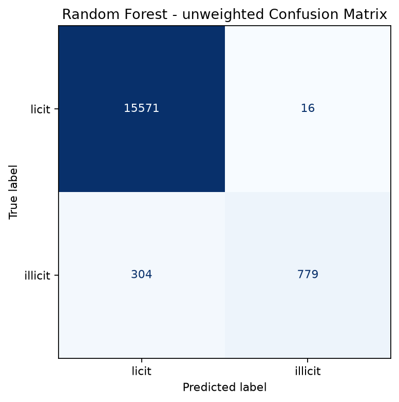
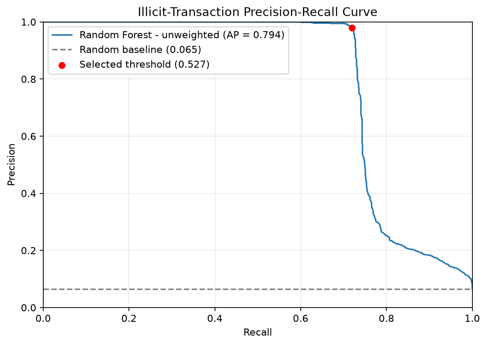
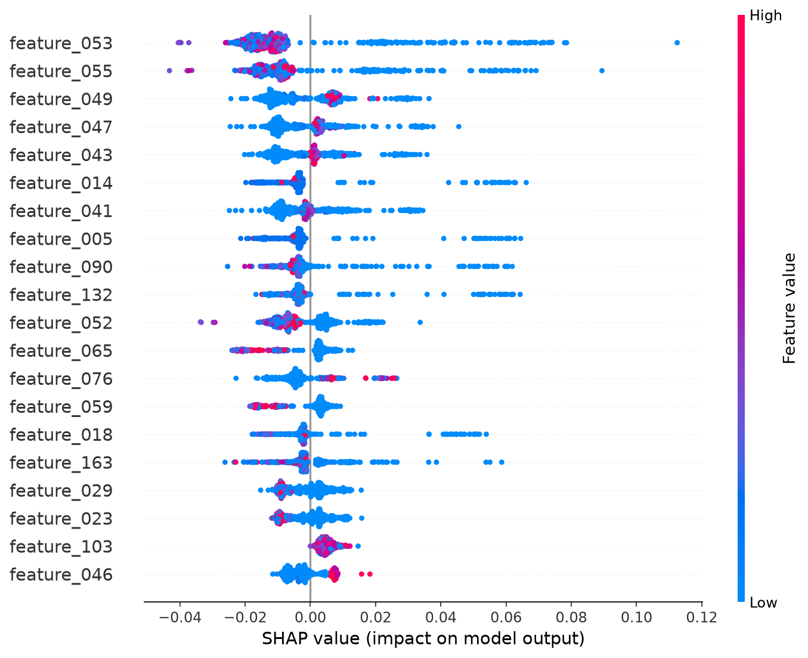
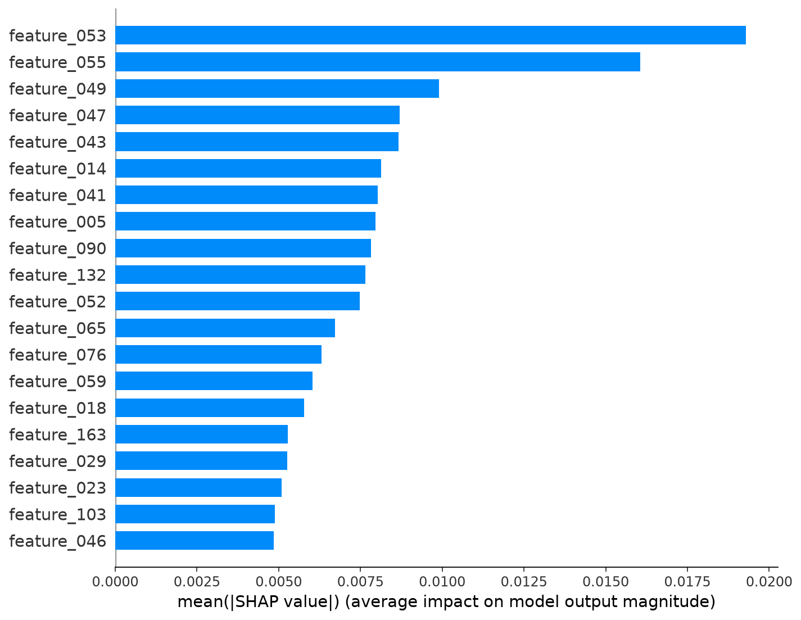
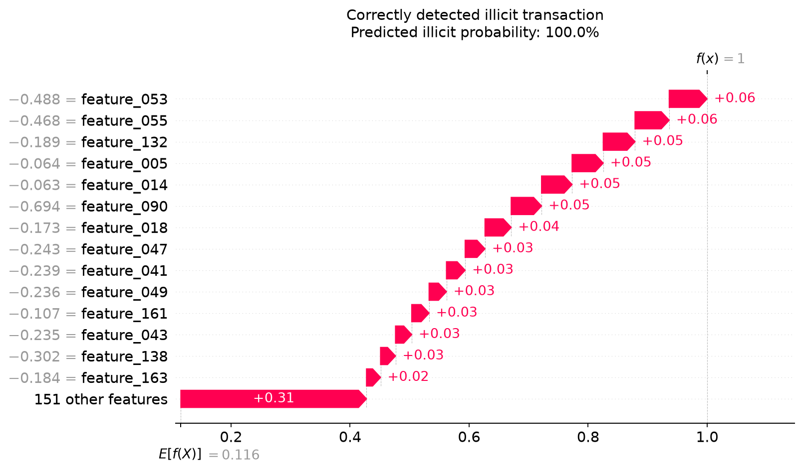
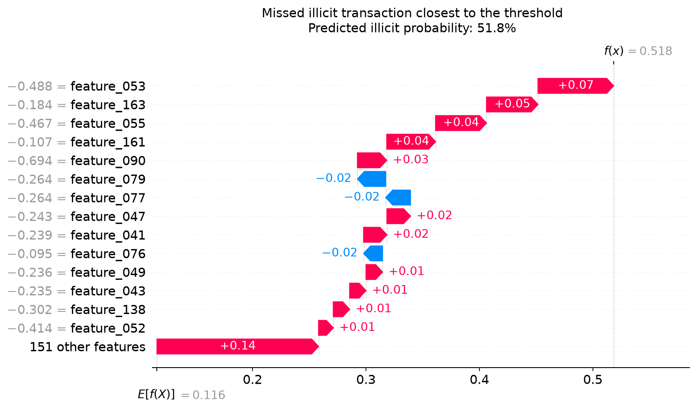
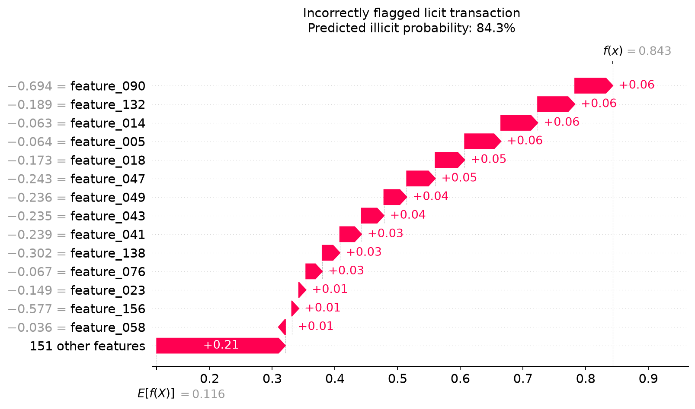

<div align="center">

# Explainable Illicit Bitcoin Transaction Detection

**A machine-learning pipeline for detecting illicit Bitcoin transactions and explaining predictions with SHAP.**


</div>

## Overview

This project uses the [Elliptic Bitcoin transaction dataset](https://www.kaggle.com/datasets/ellipticco/elliptic-data-set) to classify transactions as **licit** or **illicit**.

The pipeline processes 165 anonymised transaction features, compares several tree-based classifiers, selects a decision threshold using validation data, and evaluates the final model on later, unseen time steps. SHAP is then used to explain both global model behaviour and individual predictions.

The project is an educational exploration of cryptocurrency transaction analysis, imbalanced classification, temporal evaluation, and explainable machine learning. It is not intended as a production fraud-detection system.

## Key Features

| Feature                    | Implementation                                                                       |
| -------------------------- | ------------------------------------------------------------------------------------ |
| Transaction classification | Detects licit and illicit Bitcoin transactions                                       |
| Temporal evaluation        | Trains and tests on separate chronological time periods                              |
| Model comparison           | Evaluates Random Forest, Extra Trees, and Histogram Gradient Boosting configurations |
| Imbalance-aware metrics    | Reports precision, recall, F1, balanced accuracy, average precision, and ROC-AUC     |
| Threshold selection        | Selects the classification threshold using validation data only                      |
| Explainability             | Produces global SHAP summaries and individual waterfall explanations                 |
| Reproducibility            | Uses fixed random seeds and saves model metadata and validation results              |

## Methodology

1. Transaction features and class labels are loaded from the Elliptic dataset.
2. Transactions labelled `unknown` are excluded.
3. Original labels are converted into binary classes: `licit` and `illicit`.
4. Data is divided chronologically:

   * **Training:** time steps 1-29
   * **Validation:** time steps 30-34
   * **Testing:** time steps 35-49
5. Multiple tree-based classifiers and class-weight configurations are evaluated on the validation period.
6. The decision threshold is selected using validation predictions.
7. The selected model is retrained on the combined training and validation data.
8. Final performance is measured once on the untouched test period.
9. SHAP explanations are generated for global behaviour and representative predictions.

## Results

The selected model was an unweighted Random Forest using a decision threshold of `0.5267`.

| Metric                  | Test result |
| ----------------------- | ----------: |
| Accuracy                |      98.08% |
| Majority-class baseline |      93.50% |
| Balanced accuracy       |      85.91% |
| Illicit precision       |      97.99% |
| Illicit recall          |      71.93% |
| Illicit F1-score        |      82.96% |
| Macro F1-score          |      90.97% |
| Average precision       |      79.38% |
| ROC-AUC                 |      93.02% |

The high illicit precision means that very few licit transactions were incorrectly flagged. Recall is lower, meaning the model did not detect every illicit transaction.

<p align="center">
  
</p>

<p align="center">
  
</p>

## Explainability

SHAP measures how strongly each feature influences the model's output. The summary plot shows both the magnitude and direction of feature effects across a sample of test transactions.

The Elliptic dataset intentionally anonymises its transaction features. Therefore, explanations identify influential feature indices rather than named financial attributes.

<p align="center">
  
</p>

<details>
<summary><strong>View additional SHAP explanations</strong></summary>

<br>

### Global feature importance

<p align="center">
  
</p>

### Correctly detected illicit transaction

<p align="center">
  
</p>

### Missed illicit transaction

<p align="center">
  
</p>

### Incorrectly flagged licit transaction

<p align="center">
  
</p>

</details>

## Getting Started

<details>
<summary><strong>View dataset, installation, and usage instructions</strong></summary>

<br>

### Dataset

Download the [Elliptic Bitcoin transaction dataset from Kaggle](https://www.kaggle.com/datasets/ellipticco/elliptic-data-set).

Extract these files into a directory named `dataset` at the repository root:

```text
dataset/
├── elliptic_txs_classes.csv
├── elliptic_txs_edgelist.csv
└── elliptic_txs_features.csv
```

The dataset is not included in this repository. Refer to its Kaggle page for its documentation and usage terms.

### Installation

Clone the repository:

```bash
git clone https://github.com/maxfroggatt/Explainable-Bitcoin-Transaction-Detection.git
cd Explainable-Bitcoin-Transaction-Detection
```

Create a virtual environment:

```bash
python -m venv .venv
```

Activate it using the appropriate command.

**Windows PowerShell**

```powershell
.\.venv\Scripts\Activate.ps1
```

**Windows Command Prompt**

```cmd
.venv\Scripts\activate.bat
```

**macOS/Linux**

```bash
source .venv/bin/activate
```

Install the dependencies:

```bash
python -m pip install -r requirements.txt
```

### Usage

Train and evaluate the classifiers:

```bash
python src/train_model.py
```

Generate the SHAP explanations:

```bash
python src/explain_shap.py
```

Generated results are written to `outputs/`, including:

* Evaluation metrics and confusion matrix
* Precision-recall curve
* Validation results and model metadata
* Trained model artefact
* Test data used for explanation
* Global and local SHAP visualisations

</details>

## Limitations

* The dataset contains anonymised features, limiting the semantic interpretation of individual SHAP explanations.
* The current pipeline uses the supplied transaction features rather than directly modelling the edge list with a graph neural network.
* The dataset is highly imbalanced, so accuracy alone is not an adequate measure of performance.
* Although illicit precision is high, the model detects approximately 72% of illicit transactions and therefore still produces false negatives.
* Predictions indicate patterns learned from historical labels and do not prove that a transaction is criminal.
